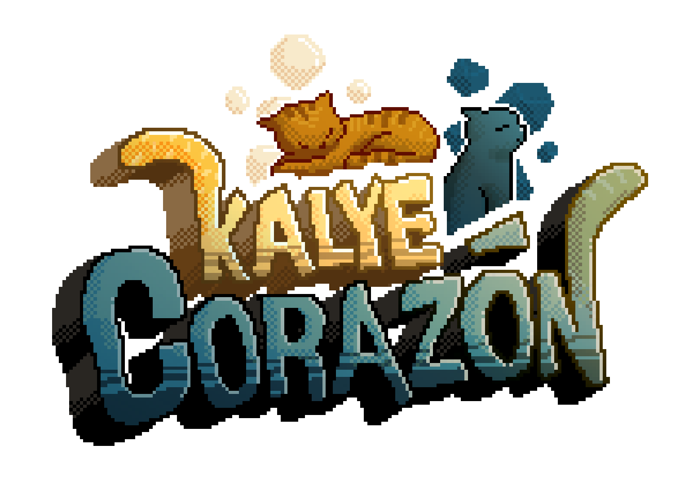

Of course. A good README is essential for any project, acting as both a welcome mat for newcomers and a technical reference for the developer (you!). Based on everything we've built and discussed, I have a comprehensive understanding of your game's components.

Here is a draft for a README file. You can copy and paste this into a `README.md` file in your project's root directory.

---

# Kalye Corazon

 <!-- Replace with a nice screenshot of your game -->

**Kalye Corazon** is a 2D narrative platformer that explores the themes of academic pressure, mental health, and finding guidance in unexpected places. The game follows Caleb, a student overwhelmed by his responsibilities, as he navigates a world that blends reality with subtle magical realism.

The environments are created with a unique, hand-drawn aesthetic, bringing a personal and artistic touch to Caleb's journey.

## Table of Contents

1.  [Gameplay](#gameplay)
2.  [Key Features](#key-features)
3.  [Creative Vision](#creative-vision)
4.  [Technical Overview](#technical-overview)
5.  [Project Structure](#project-structure)

## Gameplay

The core gameplay loop combines 2D side-scrolling exploration with narrative events and environmental puzzles.

-   **Exploration:** The player controls Caleb, moving left and right through the level. The environment is rich with detail and uses parallax scrolling across multiple layers to create a sense of depth.
-   **Narrative Events:** Key story moments are triggered by entering specific zones. These events are presented through a dialogue system, where the player can sometimes make choices that influence the outcomes.
-   **Companion AI:** After an encounter, Caleb is led by a mysterious cat. The cat's AI is designed to stay ahead of the player, acting as a guide. It intelligently repositions itself when the player changes direction and switches between walking and idle animations based on the player's movement.
-   **Minigames:** The game features environmental puzzles that are resolved through unique minigame scenes.

## Key Features

-   **Rich, Hand-Drawn Environments:** All backgrounds and level elements are hand-drawn in Krita, giving the game a distinct and personal visual style.
-   **Cinematic Dialogue System:** Dialogue is presented with cinematic camera zooms to focus the player's attention on important narrative beats.
-   **Intelligent Companion AI:** A cat companion that actively leads the player, rather than just following.
-   **Stateful World:** The game remembers player progress. Minigames, once completed, remain solved, and the world changes accordingly.
-   **Atmospheric Effects:** The game utilizes shaders and layering to create depth and mood, such as blurred, darkened crowds walking in the foreground to make the world feel alive.

## Creative Vision

### Art Style

The visual identity of *Kalye Corazon* is defined by its hand-drawn art. We combined pixel art with a softer, more organic environment that reflects the game's emotional themes. The world is built using a deep parallax system across multiple `CanvasLayer` nodes, giving the 2D space a pseudo-3D quality.

## Technical Overview

-   **Engine:** Godot Engine 4.4
-   **Language:** GDScript
-   **Key Plugins:**
    -   **Dialogue Manager 3** by Nathan Hoad is used for all dialogue, branching choices, and in-dialogue event triggers (`mutations`).

### Core Architecture

-   **Global State Management:** The game uses a globally accessible autoload singleton (`GameState.gd`) to manage persistent state across scenes. This tracks minigame completion and handles passing data between scenes (e.g., the player's return coordinates).
-   **Coordinator Pattern:** The level script (`level_1_questonhall.gd`) acts as a central "coordinator." It listens for signals from various game objects (triggers, player, dialogue manager) and directs the logic, such as telling the cat to start following or telling the camera to zoom.
-   **Modular Scene Design:** Most game objects are built as reusable, self-contained scenes. This keeps the main level scene clean and makes objects easy to manage and replicate.
-   **Physics Layers:** Collision layers and masks are used to separate physics interactions. The player and cat can pass through each other but both collide with the `world` layer. The crowd exists on a non-colliding layer.

## Project Structure

The project is organized into the following main directories:

-   **/scenes**: Contains all `.tscn` files, organized by type (levels, npcs, minigames, ui).
-   **/scripts**: Contains all `.gd` files, mirroring the scene structure. Includes the global `GameState.gd`.
-   **/assets**: Holds all external resources like sprites, fonts, and audio.
-   **/dialogue**: Contains the `.dialogue` files used by the Dialogue Manager plugin.
-   **/addons**: Houses the Dialogue Manager plugin.

